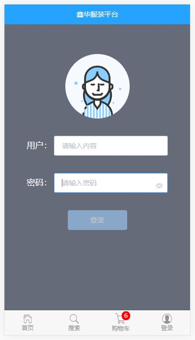

# my-vue-project

> A Vue.js project

## 效果图
``` bash
![]
```





### Build Setup
``` bash
# install dependencies
安装依赖
npm install

# serve with hot reload at localhost:8080
启动项目
npm run dev

# build for production with minification
对项目进行打包
npm run build

# build for production and view the bundle analyzer report
npm run build --report
```


For a detailed explanation on how things work, check out the [guide](http://vuejs-templates.github.io/webpack/) and [docs for vue-loader](http://vuejs.github.io/vue-loader).
